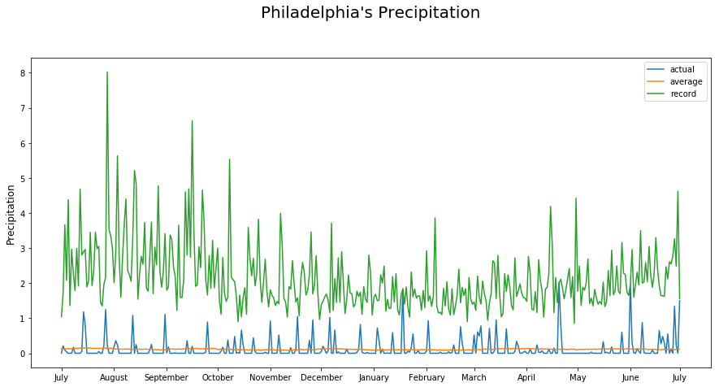
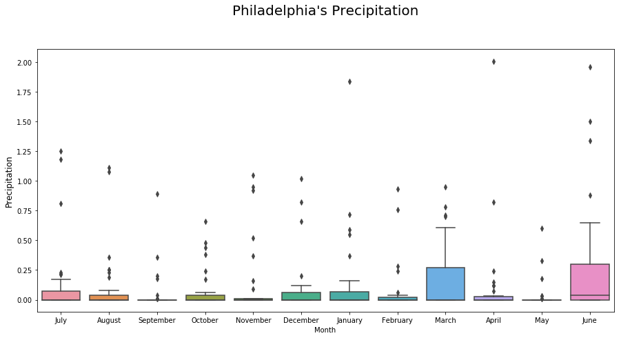
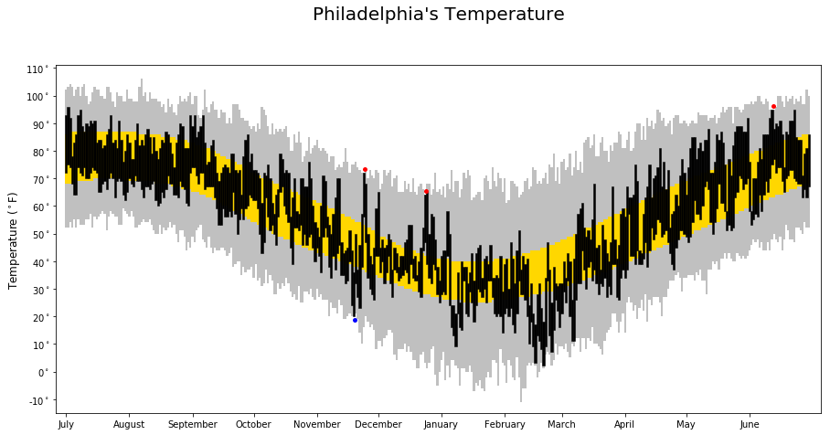
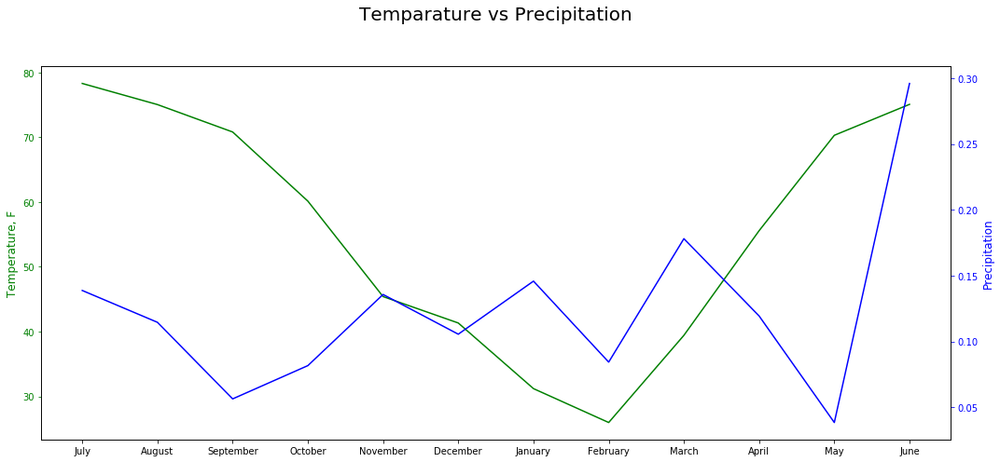

# 1. Load Weather Data for Philadelphia


```python
import matplotlib.pyplot as plt
import pandas as pd
import seaborn as sns
from datetime import datetime

url = 'https://raw.githubusercontent.com/fivethirtyeight/data/master/us-weather-history/KPHL.csv'
#Load Data and set 'date' as index column
weather_data = pd.read_csv(url,parse_dates=['date'])

```

### Check summary statistics and outliers


```python
weather_data.describe()
```


<div>
<style scoped>
    .dataframe tbody tr th:only-of-type {
        vertical-align: middle;
    }

    .dataframe tbody tr th {
        vertical-align: top;
    }

    .dataframe thead th {
        text-align: right;
    }
</style>
<table border="1" class="dataframe">
  <thead>
    <tr style="text-align: right;">
      <th></th>
      <th>actual_mean_temp</th>
      <th>actual_min_temp</th>
      <th>actual_max_temp</th>
      <th>average_min_temp</th>
      <th>average_max_temp</th>
      <th>record_min_temp</th>
      <th>record_max_temp</th>
      <th>record_min_temp_year</th>
      <th>record_max_temp_year</th>
      <th>actual_precipitation</th>
      <th>average_precipitation</th>
      <th>record_precipitation</th>
    </tr>
  </thead>
  <tbody>
    <tr>
      <th>count</th>
      <td>365.000000</td>
      <td>365.000000</td>
      <td>365.000000</td>
      <td>365.000000</td>
      <td>365.000000</td>
      <td>365.000000</td>
      <td>365.000000</td>
      <td>365.00000</td>
      <td>365.000000</td>
      <td>365.000000</td>
      <td>365.000000</td>
      <td>365.000000</td>
    </tr>
    <tr>
      <th>mean</th>
      <td>55.884932</td>
      <td>47.265753</td>
      <td>63.983562</td>
      <td>47.221918</td>
      <td>64.723288</td>
      <td>28.030137</td>
      <td>84.989041</td>
      <td>1947.30137</td>
      <td>1957.835616</td>
      <td>0.124548</td>
      <td>0.113781</td>
      <td>2.135452</td>
    </tr>
    <tr>
      <th>std</th>
      <td>18.947380</td>
      <td>18.391740</td>
      <td>19.886070</td>
      <td>15.454917</td>
      <td>16.432768</td>
      <td>19.379854</td>
      <td>12.556242</td>
      <td>35.21000</td>
      <td>35.722070</td>
      <td>0.304216</td>
      <td>0.015280</td>
      <td>0.931560</td>
    </tr>
    <tr>
      <th>min</th>
      <td>10.000000</td>
      <td>2.000000</td>
      <td>17.000000</td>
      <td>25.000000</td>
      <td>40.000000</td>
      <td>-11.000000</td>
      <td>61.000000</td>
      <td>1872.00000</td>
      <td>1874.000000</td>
      <td>0.000000</td>
      <td>0.080000</td>
      <td>0.850000</td>
    </tr>
    <tr>
      <th>25%</th>
      <td>39.000000</td>
      <td>33.000000</td>
      <td>46.000000</td>
      <td>32.000000</td>
      <td>49.000000</td>
      <td>9.000000</td>
      <td>73.000000</td>
      <td>1930.00000</td>
      <td>1931.000000</td>
      <td>0.000000</td>
      <td>0.100000</td>
      <td>1.550000</td>
    </tr>
    <tr>
      <th>50%</th>
      <td>59.000000</td>
      <td>50.000000</td>
      <td>69.000000</td>
      <td>46.000000</td>
      <td>66.000000</td>
      <td>29.000000</td>
      <td>88.000000</td>
      <td>1960.00000</td>
      <td>1957.000000</td>
      <td>0.000000</td>
      <td>0.110000</td>
      <td>1.880000</td>
    </tr>
    <tr>
      <th>75%</th>
      <td>73.000000</td>
      <td>64.000000</td>
      <td>82.000000</td>
      <td>63.000000</td>
      <td>81.000000</td>
      <td>46.000000</td>
      <td>97.000000</td>
      <td>1969.00000</td>
      <td>1990.000000</td>
      <td>0.050000</td>
      <td>0.120000</td>
      <td>2.490000</td>
    </tr>
    <tr>
      <th>max</th>
      <td>86.000000</td>
      <td>77.000000</td>
      <td>96.000000</td>
      <td>70.000000</td>
      <td>87.000000</td>
      <td>59.000000</td>
      <td>106.000000</td>
      <td>2014.00000</td>
      <td>2014.000000</td>
      <td>2.010000</td>
      <td>0.150000</td>
      <td>8.020000</td>
    </tr>
  </tbody>
</table>
</div>


```python
weather_data.isnull().sum()
```


    date                     0
    actual_mean_temp         0
    actual_min_temp          0
    actual_max_temp          0
    average_min_temp         0
    average_max_temp         0
    record_min_temp          0
    record_max_temp          0
    record_min_temp_year     0
    record_max_temp_year     0
    actual_precipitation     0
    average_precipitation    0
    record_precipitation     0
    dtype: int64


#### From the above two tables, there is neither outliers and missing values to be handled.

# 2. Data Preprocessing


```python
    weather_data_subset = weather_data # Set a copy of data
    weather_data_subset['day_order'] = range(len(weather_data_subset)) #Create index column for each date
    day_order = weather_data_subset['day_order']
    actual_mean_temp = weather_data_subset['actual_mean_temp'].values
    record_max_temps = weather_data_subset['record_max_temp'].values
    record_min_temps = weather_data_subset['record_min_temp'].values
    average_max_temps = weather_data_subset['average_max_temp'].values
    average_min_temps = weather_data_subset['average_min_temp'].values
    actual_max_temps = weather_data_subset['actual_max_temp'].values
    actual_min_temps = weather_data_subset['actual_min_temp'].values
    actual_precipitation = weather_data_subset['actual_precipitation'].values
    average_precipitation = weather_data_subset['average_precipitation'].values
    record_precipitation = weather_data_subset['record_precipitation'].values
```


```python
    #weather_data['date'].dt.month
```

### Create year and month data


```python
weather_data_subset['month'] = weather_data_subset['date'].apply(lambda x: x.strftime("%Y-%B"))
weather_data_subset['Month'] = weather_data_subset['month'].apply(lambda x: x[5::])
```

# 3. Visualization


```python
    for column in weather_data.columns:
        if column in ['date']:
            continue
    fig, ax1 = plt.subplots(figsize=(15, 7))
    
    plt.plot(day_order, actual_precipitation,label="actual")
    plt.plot(day_order, average_precipitation,label = "average")
    plt.plot(day_order, record_precipitation,label = "record")
    month_beginning_df = weather_data_subset[weather_data_subset['date'].apply(lambda x: True if x.day == 1 else False)]
    month_beginning_indeces = list(month_beginning_df['day_order'].values)
    month_beginning_names = list(month_beginning_df['date'].apply(lambda x: x.strftime("%B")).values)
    # Add the last month label manually
    month_beginning_indeces += [weather_data_subset['day_order'].values[-1]]
    month_beginning_names += ['July']
    plt.ylabel(r'Precipitation', fontsize=12)

    plt.xticks(month_beginning_indeces,
               month_beginning_names,
               fontsize=10)
    plt.legend(loc="upper right")

    plt.title('Philadelphia\'s Precipitation\n\n', fontsize=20)

```


    Text(0.5, 1.0, "Philadelphia's Precipitation\n\n")





The above line plot shows the actual (blue), average (orange) precipitation, and the highest recorded (green) precipitation for Philadelphia. From the plot, the precipitation approached to a historical high amount at the interaction between blue and green line. 
The amount of precipitation from Mid April 2015 - June 2015 was larger than other months.


```python
fig, ax = plt.subplots(figsize=(15,7))
sns.boxplot(x="Month", y="actual_precipitation", data=weather_data_subset)
plt.ylabel(r'Precipitation', fontsize=12)

plt.title('Philadelphia\'s Precipitation\n\n', fontsize=20)

```


    Text(0.5, 1.0, "Philadelphia's Precipitation\n\n")





The above boxplot shows the distribution for precipitation with respect to each month. From the plot, it shows the oveall precipitation amount in March 2015 and June 2015 were larger than the rest of months. Especially in June, there were extremely high values, which means large amount precipitation happened in this month.


```python
    for column in weather_data.columns:
        if column in ['date']:
            continue
    
    fig, ax1 = plt.subplots(figsize=(15, 7))

    # Create the bars showing all-time record highs and lows
    #plt.scatter(day_order, record_max_temps,s = 15,zorder=10, color='#d62725', alpha=0.75, linewidth=0)
    #plt.scatter(day_order, record_min_temps,s = 15,zorder=10, color='#1f77b4', alpha=0.75, linewidth=0)

    plt.bar(day_order, record_max_temps - record_min_temps, bottom=record_min_temps,
            edgecolor='none', color= 'silver', width=1)

    # Create the bars showing average highs and lows
    plt.bar(day_order, average_max_temps - average_min_temps, bottom=average_min_temps,
            edgecolor='none', color='gold', width=1)

    # Create the bars showing this year's highs and lows
    plt.bar(day_order, actual_max_temps - actual_min_temps, bottom=actual_min_temps,
            edgecolor='black', linewidth=0.5, color='black', width=1)

   
    new_max_records = weather_data_subset[weather_data_subset.record_max_temp <= weather_data_subset.actual_max_temp]
    new_min_records = weather_data_subset[weather_data_subset.record_min_temp >= weather_data_subset.actual_min_temp]
    plt.scatter(new_max_records['day_order'].values + 0.5,
                new_max_records['actual_max_temp'].values + 1.25,
                s=25, zorder=10, color='red', alpha=1, linewidth=0)

    plt.scatter(new_min_records['day_order'].values + 0.5,
                new_min_records['actual_min_temp'].values - 1.25,
                s=25, zorder=10, color='blue', alpha=1, linewidth=0)

    plt.ylim(-15, 111)
    plt.xlim(-5, 370)

    plt.yticks(range(-10, 111, 10), [r'{}$^\circ$'.format(x)
                                     for x in range(-10, 111, 10)], fontsize=10)
    plt.ylabel(r'Temperature ($^\circ$F)', fontsize=12)
    
    plt.xticks(month_beginning_indeces,
               month_beginning_names,
               fontsize=10)

    

    plt.xlim(-5, 370)
    plt.grid(False)

   
    plt.ylim(-15, 111)
    plt.grid(False)

    plt.title('Philadelphia\'s Temperature\n\n', fontsize=20)

```


    Text(0.5, 1.0, "Philadelphia's Temperature\n\n")





The above plot shows the overall temperature trend in Philadelphia. The grey area is the range between the record low and high temperature. The black bars are the range between the actual min and max temperature. The golden area in the middle is the range between the average min and max temperature. The blue and red dots represent that the actual temperature between July 2014 - June 2015 surpassed the historical low and high value respectively.
Oveall, the temperature from November 2015 to March 2015 was much lower than the remaining and this was because of winter.


```python
pivot_weather = weather_data_subset.groupby(['month']).mean()

```


```python
pivot_weather = pivot_weather.reset_index()
```


```python
pivot_weather['date'] = pd.to_datetime(pivot_weather['month'])
```


```python
pivot_weather = pivot_weather.set_index('date').sort_index()
```


```python
pivot_weather['month'] = pivot_weather['month'].apply(lambda x: x[5::])

```


```python
fig, ax1 = plt.subplots(figsize=(15, 7))
ax1.plot(pivot_weather['month'], pivot_weather['actual_mean_temp'], 'g')
# Make the y-axis label, ticks and tick labels match the line color.
ax1.set_ylabel('Temperature, F',color = 'g',fontsize=12)
ax1.tick_params('y', colors='g')

ax2 = ax1.twinx()
ax2.plot(pivot_weather['month'], pivot_weather['actual_precipitation'], color='b')
ax2.set_ylabel('Precipitation', color='b',fontsize=12)
ax2.tick_params('y', colors='b')

plt.title('Temperature vs Precipitation\n\n', fontsize=20)
fig.tight_layout()
plt.show()
```





The last plot shows the aggregate average for temperature and precipitation given each month. From this plot, we can observe the temperature decreased as precipitation increased from September 2014 to January 2014 and went upward as precipitation went down from March 2015 to May 2015. However, what is not in line with our common sense is the pattern for the remaining months especially for June 2015. The reason could be the extremely high amount of precipitation happened in the remaining months which increased the amount of precipitation on average.


```python

```


```python

```
